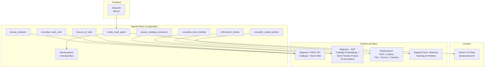
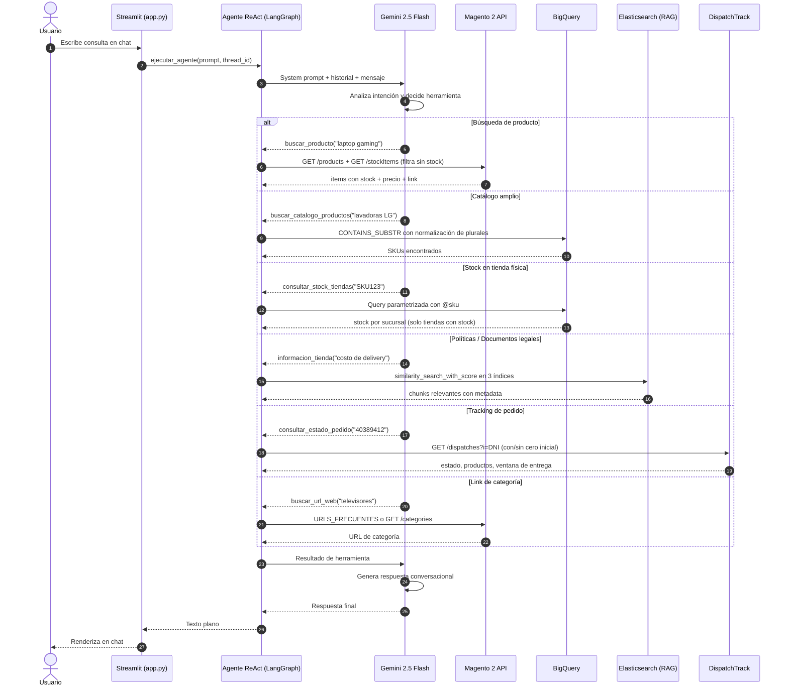

# Agente de Ventas de Retail E-commerce con RAG

**Proyecto Integrador M4 | IA Generativa**

Agente inteligente de ventas para **Hiraoka** (retail de electrodomésticos y tecnología) que atiende consultas de clientes en tiempo real conectándose a **7 fuentes de datos**: API REST de Magento 2 (catálogo y stock web), Google BigQuery (catálogo de embeddings y stock en tiendas físicas), Elasticsearch (3 índices RAG: Términos y Condiciones, Legales de Envío, Cambios y Devoluciones), y DispatchTrack/Beetrack (tracking de pedidos). La interfaz de usuario se sirve mediante **Streamlit**.

---

## 1. Problema de Negocio

### Qué problema tiene la empresa

En las grandes plataformas de e-commerce (como Magento 2), la atención al cliente en canales digitales suele ser **genérica**: el agente humano no tiene acceso inmediato al catálogo en vivo, al stock consolidado por sucursal, a las políticas legales vigentes ni al estado de los despachos, lo que genera demoras y respuestas incompletas.

### Proceso manual que se busca mejorar

| Proceso actual | Problema | Impacto |
|----------------|----------|---------|
| Cliente pregunta por productos | Las respuestas dependen de que el agente busque manualmente en Magento | Tiempo perdido, posibles errores de precio/stock |
| Cliente pregunta por stock en tienda física | El agente debe consultar sistemas internos de inventario por sucursal | Demora y posibilidad de información desactualizada |
| Cliente pregunta por políticas (delivery, garantías, devoluciones) | El agente busca en múltiples PDFs legales | Respuestas lentas, incompletas o imprecisas |
| Cliente pregunta por su pedido | El agente debe ingresar al sistema de DispatchTrack con el DNI/RUC | Proceso manual lento y propenso a errores de validación |
| Cliente busca un producto por nombre coloquial | El agente debe traducir "quiero una refri LG" a SKUs específicos | Depende del conocimiento del agente humano |

### Por qué IA Generativa aporta valor

- **Búsqueda por lenguaje natural**: El cliente dice "quiero una laptop para gaming" en vez de navegar categorías o dar un SKU exacto.
- **Consulta unificada de stock**: Un solo agente consolida stock web (Magento) y stock por sucursal (BigQuery), filtrando automáticamente productos agotados.
- **RAG multi-documento**: El sistema recupera fragmentos relevantes de 3 documentos legales (Términos y Condiciones, Legales de Envío, Cambios y Devoluciones) desde Elasticsearch con búsqueda semántica.
- **Tracking integrado**: Consulta el estado de despacho directamente con DNI o RUC, validando documentos peruanos (DNI 8 dígitos, RUC 10/15/17/20 con dígito verificador SUNAT).
- **Normalización inteligente**: Maneja plurales del español automáticamente ("lavadoras" → "lavadora", "televisores" → "televisor") para búsquedas más robustas.
- **Decisión dinámica de herramientas**: El agente decide autónomamente qué herramientas usar según el contexto conversacional.

### Resultado esperado

Un asistente que en **segundos** responde consultas de catálogo, confirma stock y precios, rastrea pedidos, genera links de navegación y cita políticas oficiales con referencia al documento y página de origen.

---

## 2. Análisis Previo

### Usuario objetivo

Clientes de Hiraoka que interactúan por canales digitales (chat web, WhatsApp) y buscan asistencia para búsqueda de productos, consultas de stock/precio, disponibilidad en tiendas físicas, tracking de pedidos o información sobre políticas de la empresa.

### Entradas del sistema

| Entrada | Ejemplo |
|---------|---------|
| Búsqueda de producto en lenguaje natural | "Quiero ver televisores Samsung 4K" |
| Búsqueda con plurales o variaciones | "Tienen lavadoras LG?" |
| Consulta de stock web por SKU | "¿Tienen stock del 127837?" |
| Consulta de stock en tienda física | "¿Hay stock en la tienda de Miraflores?" |
| Consulta sobre políticas de envío | "¿Cuánto cuesta el delivery?" |
| Consulta sobre devoluciones | "¿Puedo devolver un producto?" |
| Consulta sobre garantías | "¿Qué cubre la garantía del fabricante?" |
| Tracking de pedido por DNI | "¿Cuándo llega mi pedido? Mi DNI es 40389412" |
| Tracking de pedido por RUC | "Estado de pedido, RUC 10403894121" |
| Búsqueda de categoría/link | "Pásame el link de laptops" |

### Decisiones que el agente toma dinámicamente

1. **`buscar_producto`**: Busca productos en Magento con verificación de stock integrada. Solo devuelve productos disponibles con precio y link.
2. **`buscar_catalogo_productos`**: Busca en el catálogo completo de BigQuery para identificar SKUs por nombre, marca o categoría.
3. **`consultar_stock_web`**: Confirma precio y stock en el canal digital (requiere SKU).
4. **`consultar_stock_tiendas`**: Stock en las 5 tiendas físicas (Lima, Miraflores, San Miguel, Independencia, SJL).
5. **`informacion_tienda`**: Consulta 3 índices RAG (Términos y Condiciones, Legales de Envío, Cambios y Devoluciones).
6. **`consultar_estado_pedido`**: Tracking de pedidos vía DispatchTrack con validación de DNI/RUC peruano.
7. **`buscar_url_web`**: Genera links directos a categorías o páginas de hiraoka.com.pe.
8. **Sin herramientas**: Para saludos, horarios, datos de contacto o preguntas generales cubiertas por la información fija.

### Tareas automatizadas vs. decisión dinámica

| Tarea | Tipo | Justificación |
|-------|------|---------------|
| Elegir qué herramienta usar | Dinámico | Depende de lo que diga el cliente |
| Buscar por nombre y fallback a SKU | Automatizado | `buscar_producto` siempre intenta ambas estrategias |
| Filtrado de productos sin stock | Automatizado | `buscar_producto` y `consultar_stock_web` omiten productos agotados |
| Normalización de plurales | Automatizado | `_singularizar_es` convierte plurales a singular antes de buscar |
| Detección de sección RAG por keywords | Automatizado | `SECTION_HINTS` mapea ~100 palabras clave a secciones y documentos |
| Validación de DNI/RUC | Automatizado | `_validar_documento` valida formato y dígito verificador SUNAT |
| Filtrado por score de relevancia (>= 0.65) | Automatizado | Se descartan resultados de baja confianza antes de responder |

### Riesgos y límites

- **Latencia de APIs externas**: Si Magento, BigQuery o DispatchTrack no responden, las herramientas retornan mensajes de error controlados.
- **Cobertura RAG**: El sistema RAG cubre 3 documentos legales indexados. Preguntas fuera de esos documentos reciben "No se encontró información relevante".
- **Elasticsearch no disponible**: Si la conexión falla al iniciar, el sistema arranca sin RAG.
- **Modelo de embeddings en BigQuery**: Los embeddings del catálogo (768 dims) fueron generados con un modelo diferente al actual (`gemini-embedding-2`, 3072 dims). La búsqueda de catálogo usa `CONTAINS_SUBSTR` con normalización de plurales.

---

## 3. Arquitectura de Solución

### Tipo seleccionado: Arquitectura basada en Agente

```
Usuario (Streamlit) --> Agente ReAct (LangGraph) --> 7 Herramientas --> Respuesta final
```

### Justificación

Se eligió una **arquitectura basada en agente** (no workflow ni híbrida) por las siguientes razones:

1. **Las decisiones son dinámicas**: No se puede predecir qué herramienta necesitará el agente en cada turno.
2. **No aplica workflow**: Un workflow requiere pasos predecibles. En atención al cliente real, el flujo depende enteramente de lo que diga el cliente.
3. **Principio de mínima complejidad**: Un agente ReAct con `create_react_agent` resuelve el problema completo sin necesidad de dispatcher, routers ni múltiples agentes.

### Diagrama de arquitectura



---

## 4. Principio de Mínima Complejidad

| Componente | Incluido | Justificación |
|------------|----------|---------------|
| **Agente ReAct** | Si | Necesario: el agente decide qué herramienta usar según el contexto |
| **7 herramientas** | Si | Cada una resuelve una necesidad real del cliente |
| **Memoria en sesión** (MemorySaver) | Si | Necesaria: sin ella, el agente pierde contexto entre turnos |
| **RAG con Elasticsearch** (3 índices) | Si | Necesario: permite consultar 3 documentos legales con precisión semántica |
| **Normalización de búsqueda** | Si | Necesario: maneja plurales/variaciones del español para búsquedas robustas |
| **Validación de DNI/RUC** | Si | Necesario: valida documentos peruanos antes de consultar tracking |
| **Streamlit** | Si | Necesario: interfaz de chat amigable para el usuario final |
| **Dispatcher** | No | No necesario: un solo agente maneja todas las interacciones |
| **Workflow** | No | No necesario: el flujo no es predecible ni secuencial |
| **Múltiples agentes** | No | No necesario: un solo agente con herramientas es suficiente |

---

## 5. Orquestación y Componentes

### 5.0 Orquestador

El sistema utiliza un orquestador basado en **LangGraph** (`create_react_agent`), responsable de coordinar el flujo conversacional. Recibe el mensaje del usuario, mantiene el estado conversacional con un checkpointer (`MemorySaver`), decide cuándo invocar herramientas según el razonamiento semántico del modelo, y aplana la respuesta a texto plano para garantizar compatibilidad con Streamlit.

### 5.1 Agente

El agente utiliza **Gemini 2.5 Flash** (`temperature=0`) como cerebro de razonamiento. Recibe directrices estrictas a través del system prompt que incluyen:
- **Información fija**: Datos de contacto, horarios de tiendas, métodos de pago.
- **Instrucciones de uso de 7 herramientas**: Cuándo y cómo usar cada una.
- **Flujo de atención al cliente**: Buscar producto → verificar stock → mostrar solo disponibles → incluir link.
- **Manejo de producto no encontrado**: Buscar alternativas compatibles, nunca solo decir "no lo tenemos".
- **Reglas críticas**: No mostrar agotados, no mostrar cantidad de stock, no enviar links rotos, responder en texto plano.

### 5.2 Dispatcher (No aplica)

No se implementó un dispatcher porque el patrón **ReAct (Reasoning and Acting)** ya realiza una **clasificación implícita de la intención** del usuario en tiempo de ejecución.

### 5.3 Workflow (No aplica)

No se implementó un workflow secuencial porque el flujo conversacional no sigue pasos lineales ni predecibles.

### 5.4 Flujo de Funcionamiento Conversacional



---

## 6. Detalle Técnico de Herramientas

### 6.1 `buscar_producto(busqueda: str)`

Busca productos en el catálogo de Magento por nombre o SKU. **Verifica stock de cada producto** y solo devuelve los que tienen disponibilidad. Incluye precio (con precio especial si existe) y link del producto vía `url_key`.

- **Normalización**: Aplica `_singularizar_es` para manejar plurales ("lavadoras" → "lavadora").
- **Fallback**: Si no encuentra por nombre, busca por SKU parcial.
- **Filtrado de stock**: Consulta `stockItems/{sku}` por cada resultado, descarta `qty <= 0`.
- **Límite**: Máximo 5 resultados con stock, de un pool de hasta 10 candidatos.

**Formato de salida**: `SKU: XXX | Nombre | S/precio | link`

### 6.2 `buscar_catalogo_productos(busqueda: str)`

Busca productos en el catálogo completo de BigQuery usando `CONTAINS_SUBSTR` con normalización de plurales. Ideal para búsquedas amplias por categoría, marca o tipo de producto.

- **Normalización**: Cada palabra se singulariza antes de buscar.
- **Búsqueda**: `CONTAINS_SUBSTR(content, @palabra)` con AND entre palabras.
- **Fallback**: También busca por SKU con `CONTAINS_SUBSTR(sku, @busqueda_completa)`.
- **Tabla**: `pe-hiraoka-crmda-01.raw_dtrf_ga4.catalogo_embeddings_fixed`

### 6.3 `consultar_stock_web(sku: str)`

Consulta stock y precio actual de uno o varios SKUs (separados por coma). **Solo muestra productos con stock > 0**.

- Dos llamadas a Magento por SKU: `GET /products` (precio) + `GET /stockItems/{sku}` (cantidad).
- Si todos los SKUs consultados están agotados, responde con mensaje informativo.

### 6.4 `consultar_stock_tiendas(sku: str)`

Consulta stock en las 5 tiendas físicas mediante query parametrizada a BigQuery. **Solo muestra tiendas con stock disponible**.

- Cruza 3 tablas: `stock_amaesuc` (sucursales), `stock_consolidado_actual` (inventario), `catalogo` (nombres).
- Usa `@sku` como parámetro (prevención de SQL injection).
- Si ninguna tienda tiene stock, responde con mensaje informativo.

### 6.5 `informacion_tienda(query: str)`

Busca información en **3 índices de Elasticsearch** (RAG multi-documento):

| Índice | Documento | Cobertura |
|--------|-----------|-----------|
| `rag_hiraoka_terminosycondiciones` | Términos y Condiciones | Pagos, delivery, combos, contacto |
| `rag_hiraoka_legales_envio` | Legales de Envío | Envío hoy, regular, same day, recojo en tienda |
| `rag_hiraoka_cambiosydevoluciones` | Cambios y Devoluciones | Devoluciones, garantías, arrepentimiento, productos sensibles |

**Flujo interno**:
1. **Detección de sección**: `SECTION_HINTS` (~100 keywords) mapea a `(section_slug, store_key)`.
2. **Routing a índice**: Si detecta keyword, busca en el índice específico con filtros DSL.
3. **Fallback global**: Si no detecta keyword, busca en los 3 índices (k=3 cada uno), merge y top 5.
4. **Filtro por confianza**: Descarta resultados con score < 0.65.

### 6.6 `consultar_estado_pedido(documento: str)`

Consulta el estado de entrega de pedidos vía **DispatchTrack/Beetrack API**.

**Validación de documentos peruanos** (`_validar_documento`):
- **DNI**: 8 dígitos.
- **RUC Persona Natural** (10, 15, 17): 11 dígitos, dígito verificador SUNAT (pesos: `[5,4,3,2,7,6,5,4,3,2]`, mod 11). Extrae DNI de posiciones 2-9.
- **RUC Persona Jurídica** (20): 11 dígitos, misma validación de dígito verificador.

**Manejo de ceros iniciales**: Beetrack almacena DNIs sin ceros iniciales. La herramienta prueba primero con `lstrip("0")`, luego con el DNI original, luego con el RUC completo.

**Formato de salida**: Pedido ID + Estado, Productos, Ventana de entrega estimada.

### 6.7 `buscar_url_web(consulta: str)`

Busca la URL de una categoría o página informativa en hiraoka.com.pe.

- **Diccionario curado**: `URLS_FRECUENTES` con ~60 keywords mapeados a paths (refrigeradoras, laptops, combos, libro de reclamaciones, etc.).
- **Fallback**: Si no está en el diccionario, consulta el árbol de categorías de Magento (`GET /categories`).
- **Normalización**: Elimina acentos con `unicodedata.normalize`.

---

## 7. Pipeline RAG: Múltiples Documentos

El sistema RAG indexa **3 documentos legales** en Elasticsearch, cada uno en su propio índice vectorial.

### 7.1 Índices y Documentos

| Índice | Documento | Notebook de ingesta |
|--------|-----------|---------------------|
| `rag_hiraoka_terminosycondiciones` | Términos y Condiciones (18 págs) | `rag_hiraoka_modified.ipynb` |
| `rag_hiraoka_legales_envio` | Legales de Envío | `rag_hiraoka_legal_envios.ipynb` |
| `rag_hiraoka_cambiosydevoluciones` | Cambios y Devoluciones | `rag_hiraoka_cambios_devoluciones.ipynb` |

### 7.2 Proceso de Ingesta (común a los 3)

| Paso | Detalle |
|------|---------|
| **Loader** | `PyPDFLoader` (LangChain) - extrae texto por página |
| **Detección de secciones** | Definidas manualmente con jerarquía `slug`, `title`, `parent` |
| **Splitter** | `RecursiveCharacterTextSplitter` (chunk_size=800, overlap=150) |
| **Embeddings** | `gemini-embedding-2` (Google) |
| **Vector Store** | `ElasticsearchStore` (LangChain) |
| **IDs de chunks** | Estables, basados en `{slug}_{número}` |

### 7.3 Metadata por Chunk

Cada chunk hereda metadata jerárquica (hasta 3 niveles: section → subsection → sub_subsection):

```json
{
  "documento": "Legales Envios",
  "section_slug": "envio_regular",
  "section_title": "Envío Regular",
  "subsection_slug": "turno_entrega",
  "subsection_title": "Turno de Entrega",
  "page_start": 3,
  "page_end": 4
}
```

### 7.4 SECTION_HINTS: Routing Inteligente

Mapa de ~100 keywords organizados por prioridad (específicos primero, genéricos al final). Cada keyword resuelve a `(section_slug, store_key)`:

| Keywords | Sección destino | Índice |
|----------|----------------|--------|
| envío hoy, hoy mismo, entrega hoy | `envios_hoy` | envios |
| envío regular, 24 horas, programar entrega | `envio_regular` | envios |
| same day, entrega mismo día | `same_day` | envios |
| recojo tienda, retiro tienda | `entrega_tienda` | envios |
| devolución, devolver, cambiar producto | `politica_devoluciones` | cambios |
| arrepentimiento, ya no lo quiero | `derecho_arrepentimiento` | cambios |
| garantía fabricante, proveedor | `garantia_fabricante` | cambios |
| reembolso, extorno, nota de crédito | `devolucion_dinero` | cambios |
| delivery, costo envío, tarifa | `delivery_costos` | terminos |
| OKA, cuotas, crédito | `pago_oka` | terminos |
| combo | `arma_combo` | terminos |

### 7.5 Umbral de Relevancia

Los resultados con score por debajo de **0.65** se descartan automáticamente. Los resultados válidos se ordenan por score descendente y se formatean incluyendo sección, rango de páginas y contenido.

---

## 8. Normalización de Búsqueda

### 8.1 Singularización del Español (`_singularizar_es`)

Convierte plurales del español a singular para búsquedas más robustas:

| Patrón | Regla | Ejemplo |
|--------|-------|---------|
| `-ores`, `-ares`, `-iones`, `-ades` | Eliminar `-es` | televisores → televisor, celulares → celular |
| `-ces` | Reemplazar por `-z` | lápices → lápiz |
| `-s` (genérico) | Eliminar `-s` | lavadoras → lavadora, laptops → laptop |
| Excepciones | No modificar | microondas, gas, windows, series |

### 8.2 Dónde se aplica

- **`buscar_producto`**: Normaliza la búsqueda antes del `LIKE` de Magento.
- **`buscar_catalogo_productos`**: Normaliza cada palabra antes del `CONTAINS_SUBSTR` de BigQuery.

---

## 9. Controles Implementados y Buenas Prácticas

### 9.1 Control de Dominio

El agente está restringido mediante su system prompt a temas de retail e-commerce de Hiraoka.

### 9.2 Filtrado de Stock

- **`buscar_producto`**: Verifica stock de cada producto via `stockItems/{sku}`. Solo muestra productos con `qty > 0`.
- **`consultar_stock_web`**: Solo muestra productos con stock disponible.
- **`consultar_stock_tiendas`**: Solo muestra tiendas con stock disponible.
- **System prompt**: Instrucción explícita de nunca mostrar ni recomendar productos agotados. No mostrar cantidad de stock al cliente.

### 9.3 Control de URLs

- Los productos con stock incluyen su link individual via `url_key`.
- Si no hay productos con stock, se ofrece el link general de la categoría via `buscar_url_web`.
- El agente siempre incluye un link de categoría cuando el cliente pregunta por productos.

### 9.4 Validación de Documentos (DNI/RUC)

- Validación de formato: 8 dígitos (DNI) o 11 dígitos (RUC).
- Validación de prefijo RUC: solo 10, 15, 17 (persona natural) o 20 (jurídica).
- Dígito verificador SUNAT: pesos `[5,4,3,2,7,6,5,4,3,2]`, mod 11.
- Manejo de ceros iniciales en Beetrack.

### 9.5 Manejo de Errores

- **Validación de entorno**: Variables requeridas se validan al inicio.
- **Fallback en BigQuery**: Si `service_account.json` no existe, el sistema arranca sin catálogo ni stock de tiendas.
- **Fallback en Elasticsearch**: Si la conexión falla, arranca sin RAG.
- **Errores de API Magento**: `call_magento_api` captura excepciones y retorna errores controlados.
- **SQL Injection**: Queries de BigQuery usan parámetros (`@sku`, `@w0`, etc.).
- **Respuestas estructuradas**: `ejecutar_agente` aplana arrays de diccionarios de Gemini a texto plano.

### 9.6 Flujo Inteligente de Atención

El system prompt define un flujo de atención al cliente:

1. **Producto encontrado con stock**: Muestra nombre, precio y link del producto.
2. **Producto no encontrado exacto**: Busca alternativas compatibles de la misma marca/tipo y sugiere verificar compatibilidad.
3. **Sin stock**: Ofrece link general de categoría para que el cliente explore.
4. **Accesorio específico**: Busca accesorios genéricos de la marca y sugiere verificar compatibilidad con el modelo.

---

## 10. Demo de Decisiones del Agente (Reasoning Table)

| Mensaje del Usuario | Razonamiento del Agente | Herramienta(s) Ejecutada(s) | Resultado |
|---------------------|-------------------------|------------------------------|-----------|
| "Quiero ver lavadoras LG" | Busca productos normalizando plural | `buscar_producto("lavadora LG")` + `buscar_url_web("lavadora")` | Lavadoras LG con stock + link de categoría |
| "¿Tienen stock del 127837?" | Consulta disponibilidad por SKU | `consultar_stock_web("127837")` | Precio y disponibilidad (solo si hay stock) |
| "¿Hay en la tienda de Miraflores?" | Stock en tienda física | `consultar_stock_tiendas("127837")` | Solo tiendas con stock disponible |
| "Necesito un control remoto para TV Miray MS40-E200" | No encuentra modelo exacto, busca alternativas | `buscar_producto("control remoto Miray")` | Controles Miray compatibles + sugerencia de verificar compatibilidad |
| "¿Cuánto cuesta el delivery?" | Políticas de envío | `informacion_tienda("costo de delivery")` | Tabla de costos desde Legales de Envío |
| "¿Puedo devolver un producto?" | Políticas de devolución | `informacion_tienda("devolver producto")` | Política de devoluciones desde Cambios y Devoluciones |
| "¿Cuándo llega mi pedido? DNI 40389412" | Tracking con validación de DNI | `consultar_estado_pedido("40389412")` | Pedido, estado, productos y ventana de entrega |
| "Pásame el link de televisores" | URL de categoría | `buscar_url_web("televisores")` | `https://hiraoka.com.pe/televisores/televisores` |

---

## 11. Estructura del Proyecto

| Archivo | Propósito |
|---------|-----------|
| `magento_agent.py` | Agente principal: 7 herramientas, configuración RAG (3 índices), normalización de búsqueda, validación DNI/RUC, conexión a Magento/BigQuery/Elasticsearch/DispatchTrack, system prompt y orquestador |
| `app.py` | Interfaz web con Streamlit: chat interactivo, historial de sesión, spinner de carga |
| `rag_hiraoka_modified.ipynb` | Notebook de ingesta RAG: Términos y Condiciones |
| `rag_hiraoka_legal_envios.ipynb` | Notebook de ingesta RAG: Legales de Envío |
| `rag_hiraoka_cambios_devoluciones.ipynb` | Notebook de ingesta RAG: Cambios y Devoluciones |
| `Terminos_Condiciones.pdf` | PDF fuente: Términos y Condiciones de Hiraoka |
| `Legales_Envios.pdf` | PDF fuente: Legales de Envío |
| `CambiosyDevoluciones.pdf` | PDF fuente: Cambios y Devoluciones |
| `requirements.txt` | Dependencias del proyecto |
| `.env` | Variables de entorno (API keys, credenciales) |
| `service_account.json` | Credenciales de servicio de GCP para BigQuery (no versionado) |
| `elasticstore_urp.txt` | Contraseña de Elasticsearch (no versionado) |

---

## 12. Stack Tecnológico

| Componente | Tecnología | Uso |
|------------|------------|-----|
| **LLM** | Gemini 2.5 Flash (temperature=0) | Cerebro del agente, razonamiento y generación de respuestas |
| **Embeddings** | gemini-embedding-2 (Google) | Vectorización de chunks para búsqueda semántica en RAG |
| **Framework de agente** | LangGraph + LangChain | Patrón ReAct con `create_react_agent` |
| **Memoria conversacional** | MemorySaver (LangGraph) | Checkpointer para contexto entre turnos |
| **E-commerce** | Magento 2 REST API | Catálogo de productos, stock web y árbol de categorías |
| **Data Warehouse** | BigQuery (GCP) | Catálogo de embeddings + stock en 5 tiendas físicas |
| **Vector Store** | Elasticsearch + ElasticsearchStore | 3 índices vectoriales para RAG multi-documento |
| **Tracking** | DispatchTrack / Beetrack API | Estado de despacho de pedidos |
| **Frontend** | Streamlit | Interfaz de chat web interactiva |

---

## 13. Configuración y Ejecución

### Variables de Entorno (`.env`)

| Variable | Servicio | Requerida | Descripción |
|----------|----------|-----------|-------------|
| `GOOGLE_API_KEY` | Google Gemini | Si | API key para el LLM y embeddings |
| `MAGENTO_BASE_URL` | Magento 2 | Si | URL base de la API REST de Magento |
| `MAGENTO_ACCESS_TOKEN` | Magento 2 | Si | Token Bearer para autenticación |
| `API_KEY_BEETRACK` | DispatchTrack | Si | Token de autenticación para tracking de pedidos |
| `ES_URL` | Elasticsearch | No | URL del servidor (default: `http://104.198.172.31:9200`) |
| `ES_USER` | Elasticsearch | No | Usuario (default: `elastic`) |
| `ES_PASSWORD` | Elasticsearch | No | Contraseña (o leer de `elasticstore_urp.txt`) |
| `EMBEDDING_MODEL` | Google | No | Modelo de embeddings (default: `gemini-embedding-2`) |
| `LANGCHAIN_TRACING_V2` | LangSmith | No | Habilitar tracing (`true`) |
| `LANGCHAIN_API_KEY` | LangSmith | No | API key para observabilidad |
| `LANGCHAIN_PROJECT` | LangSmith | No | Nombre del proyecto en LangSmith |

### Dependencias

```bash
pip install -r requirements.txt
```

Dependencias principales:
- `langchain`, `langchain-google-genai`, `langgraph` - Framework de agente
- `langchain-elasticsearch` - Integración con Elasticsearch para RAG
- `google-cloud-bigquery` - Catálogo y stock en tiendas físicas
- `requests` - Llamadas a Magento REST API y DispatchTrack
- `streamlit` - Interfaz de chat web
- `python-dotenv` - Variables de entorno

### Ejecución

**1. Interfaz Gráfica con Streamlit (Recomendado)**
```bash
streamlit run app.py
```

**2. Consola de comandos (CLI)**
```bash
python magento_agent.py
```

### Re-indexación del RAG (opcional)

Si se necesita actualizar los índices de Elasticsearch con nuevos PDFs:

```bash
jupyter notebook rag_hiraoka_modified.ipynb           # Términos y Condiciones
jupyter notebook rag_hiraoka_legal_envios.ipynb        # Legales de Envío
jupyter notebook rag_hiraoka_cambios_devoluciones.ipynb # Cambios y Devoluciones
```

Ejecutar todas las celdas de la **Parte 1 (Ingesta)** con `RECREATE_INDEX = True`.

### Ejemplo de interacción

```
Tú: ¿Tienen lavadoras LG?
Asistente: ¡Claro! Tenemos las siguientes lavadoras LG disponibles:

           - Lavadora LG WT19BPB (SKU: 127837) - S/1,899
           - Lavadora LG WD2100WM (SKU: 125918) - S/3,499
           - Lavadora Secadora LG WD22BV2S6 (SKU: 119995) - S/4,299

           Puedes ver toda nuestra línea de lavadoras aquí:
           https://hiraoka.com.pe/electrohogar/lavado-y-limpieza/lavadoras

           ¿Te gustaría consultar stock en alguna tienda física?

Tú: ¿Cuándo llega mi pedido? Mi DNI es 40389412
Asistente: Se encontraron 2 pedidos para tu DNI:

           Pedido: HK-2026-001 | Estado: En ruta de entrega
           Productos: Refrigeradora LG LS-65SXN (x1)
           Ventana de entrega estimada: 22/06/2026 a 24/06/2026

           Las fechas son estimadas y pueden variar ligeramente.
           ¿Hay algo más en lo que pueda ayudarte?

Tú: ¿Puedo devolver un producto?
Asistente: Según nuestra política de Cambios y Devoluciones, puedes
           solicitar la devolución de un producto dentro de los 7 días
           calendario posteriores a la entrega...

           Fuentes:
           - Documento: Cambios y Devoluciones
           - Sección: Política de Devoluciones
```
