# Agente de Ventas de Retail E-commerce - con Memoria de Cliente

**Proyecto Integrador M2 | IA Generativa**

Agente inteligente de ventas para **Retail E-commerce** (tienda de electrodomésticos y tecnología) que identifica clientes por DNI, recuerda sus compras pasadas, detecta carritos abandonados y personaliza la atención en tiempo real utilizando datos de prueba locales basados en archivos JSON dedicados por endpoint.

---

## 1. Problema de Negocio

### Qué problema tiene la empresa

En las grandes plataformas de e-commerce (como Magento 2), la atención al cliente en canales digitales suele ser **genérica**: el agente humano no tiene visibilidad inmediata del historial del cliente, sus preferencias de compra ni sus carritos abandonados.

### Proceso manual que se busca mejorar

| Proceso actual | Problema | Impacto |
|----------------|----------|---------|
| Cliente contacta por chat/teléfono | El agente no sabe quién es hasta que busca manualmente en el sistema | Tiempo perdido, experiencia impersonal |
| Cliente pregunta por productos | Las recomendaciones son genéricas, sin considerar historial | Baja tasa de conversión |
| Cliente abandona un carrito | Nadie le hace seguimiento proactivo | Se pierden ventas potenciales |
| Cliente tiene múltiples cuentas | El sistema solo busca en una cuenta | Historial incompleto, mala experiencia |

### Por qué IA Generativa aporta valor

- **Búsqueda de productos por lenguaje natural**: El cliente dice "quiero una laptop para gaming" en vez de navegar categorías.
- **Generación de perfil inteligente**: El LLM analiza decenas de órdenes y genera un resumen de preferencias que un humano tardaría minutos en construir.
- **Recomendaciones personalizadas**: Basadas en historial real, no en reglas estáticas.
- **Memoria conversacional**: Recuerda lo que se habló en sesiones anteriores.
- **Decisión dinámica de herramientas**: El agente decide autónomamente si necesita buscar un producto, consultar stock o validar un cupón según lo que dice el cliente.

### Resultado esperado

Un asistente que en **segundos** identifica al cliente, conoce sus preferencias, detecta oportunidades de venta (carritos abandonados) y personaliza cada interacción.

---

## 2. Análisis Previo

### Usuario objetivo

Clientes del Retail E-commerce que interactúan por canales digitales (chat, WhatsApp, teléfono) y buscan asistencia para compras, consultas de stock, seguimiento de pedidos o recomendaciones.

### Entradas del sistema

| Entrada | Ejemplo |
|---------|---------|
| DNI del cliente | `48014673` |
| Búsqueda de producto en lenguaje natural | "Quiero ver televisores 4K" |
| Consulta de stock por SKU | "¿Tienen stock del SKU ASUS-ROG-01?" |
| Consulta de pedido | "¿Cómo va mi último pedido?" |
| Código de cupón | "¿Es válido el cupón DESCUENTO10?" |

### Decisiones que el agente toma dinámicamente

1. **Cuándo usar `identificar_cliente`**: Si el usuario da un DNI o número de 8 dígitos.
2. **Cuándo usar `buscar_producto`**: Si menciona un producto, marca o categoría.
3. **Cuándo usar `consultar_stock_real`**: Si pregunta por disponibilidad o precio exacto de un SKU.
4. **Cuándo usar `consultar_ultima_orden`**: Si pregunta por el estado de un pedido.
5. **Cuándo usar `validar_cupon`**: Si menciona un código de descuento.
6. **Cuándo NO usar herramientas**: Para saludos, preguntas generales o conversación natural.

### Tareas automatizadas vs. decisión dinámica

| Tarea | Tipo | Justificación |
|-------|------|---------------|
| Pedir DNI al inicio | Predecible | Siempre ocurre al inicio |
| Elegir qué herramienta usar | Dinámico | Depende de lo que diga el cliente |
| Generar resumen de perfil | Predecible | Siempre se ejecuta al identificar un cliente nuevo |
| Personalizar recomendaciones | Dinámico | Depende del historial y el contexto de la conversación |
| Guardar resumen de conversación | Predecible | Siempre ocurre al cerrar la sesión |

### Riesgos y límites

- **Latencia en primera identificación**: La primera vez que un cliente da su DNI, el sistema consulta los datos + genera resumen con IA (~5-10 segundos). Las siguientes veces es instantáneo (caché en PostgreSQL).
- **Clientes con múltiples cuentas**: Un cliente puede tener 2+ cuentas con el mismo DNI pero diferente email. El sistema las consolida automáticamente.
- **Independencia de APIs externas**: En modo pruebas, el sistema lee archivos JSON locales que actúan como mock-ups, permitiendo probar toda la lógica del agente sin necesidad de conectarse a producción.

---

## 3. Arquitectura de Solución

### Tipo seleccionado: Arquitectura basada en Agente

```
Usuario --> Agente ReAct (create_react_agent) --> Herramientas --> Memoria --> Respuesta final
```

### Justificación

Se eligió una **arquitectura basada en agente** (no workflow ni híbrida) por las siguientes razones:

1. **Las decisiones son dinámicas**: No se puede predecir qué herramienta necesitará el agente en cada turno. Un cliente puede empezar preguntando por stock, luego dar su DNI, luego pedir recomendaciones. El orden no es fijo.
2. **No aplica workflow**: Un workflow requiere pasos predecibles (clasificar -> procesar -> responder). En este caso, el flujo depende enteramente de lo que diga el cliente.
3. **No aplica híbrida**: No hay una parte "simple" que pueda resolverse con un workflow separado. Todas las interacciones requieren razonamiento sobre contexto.
4. **Principio de mínima complejidad**: Un agente ReAct con `create_react_agent` resuelve el problema completo. Agregar un dispatcher o workflow añadiría complejidad sin valor.

### Diagrama de arquitectura

```mermaid
graph TD
    subgraph "Cerebro"
        LLM["Gemini 2.5 Flash"]
    end

    subgraph "Fuentes de Datos (Modo Mock Local)"
        M_C["mock_customers.json<br/>Clientes & DNI"]
        M_O["mock_orders.json<br/>Histórico de Órdenes"]
        M_Q["mock_carts.json<br/>Carritos Abandonados"]
        M_P["mock_products.json<br/>Catálogo & Stock"]
        M_U["mock_coupons.json<br/>Cupones de Descuento"]
        PG["PostgreSQL - Base de Datos<br/>Perfiles Generados + Memoria"]
    end

    subgraph "Agente ReAct (LangGraph)"
        AG["create_react_agent"]
        CK["MemorySaver<br/>(checkpointer)"]
        T1["identificar_cliente"]
        T2["buscar_producto"]
        T3["consultar_stock_real"]
        T4["buscar_cliente"]
        T5["consultar_ultima_orden"]
        T6["validar_cupon"]
    end

    AG --> LLM
    AG --> CK
    T1 --> PG
    T1 --> M_C
    T1 --> M_O
    T1 --> M_Q
    T1 --> LLM
    T2 --> M_P
    T3 --> M_P
    T4 --> M_C
    T5 --> M_O
    T6 --> M_U
```



---

## 4. Principio de Mínima Complejidad

| Componente | Incluido | Justificación |
|------------|----------|---------------|
| **Agente ReAct** | Sí | Necesario: el agente decide qué herramienta usar según el contexto |
| **6 herramientas** | Sí | Cada una resuelve una necesidad real del negocio (identificación, catálogo, stock, pedidos, cupones) |
| **Memoria en sesión** (MemorySaver) | Sí | Necesaria: sin ella, el agente pide el DNI en cada turno |
| **Memoria entre sesiones** (PostgreSQL) | Sí | Necesaria: permite recordar conversaciones pasadas y personalizar la próxima visita |
| **Dispatcher** | No | No necesario: un solo agente maneja todas las interacciones |
| **Workflow** | No | No necesario: el flujo no es predecible ni secuencial |
| **Múltiples agentes** | No | No necesario: un solo agente con herramientas es suficiente |
| **RAG / Vectores** | No | No necesario: los datos vienen de APIs/JSON estructurados, no de documentos |
| **Guardrails avanzados** | No | No necesario en esta etapa; el system prompt define los límites |

---

## 5. Componentes Usados

### 5.1 Agente (Orquestador)

El agente es un **ReAct Agent** creado con `create_react_agent` de LangGraph. Funciona como orquestador único: recibe el mensaje del usuario, razona sobre qué herramienta usar (o si responder directamente), ejecuta la herramienta, y genera la respuesta final.

### 5.2 Herramientas Personalizadas

| # | Tool | Qué hace | Fuente de datos | Cuando la usa el agente |
|---|------|----------|-----------------|-------------------------|
| 1 | `identificar_cliente(dni)` | Busca al cliente por DNI en todas sus cuentas, obtiene órdenes y carritos abandonados, genera perfil con IA y lo guarda en PostgreSQL | PostgreSQL + JSON Mock + Gemini | Cuando el cliente proporciona su DNI |
| 2 | `buscar_producto(busqueda)` | Busca productos por nombre, marca o SKU en el catálogo local | `mock_products.json` | Cuando el cliente busca un producto |
| 3 | `consultar_stock_real(sku)` | Consulta stock en tiempo real y precio actual. Soporta múltiples SKUs | `mock_products.json` | Cuando preguntan por disponibilidad |
| 4 | `buscar_cliente(nombre)` | Busca datos de un cliente por nombre | `mock_customers.json` | Cuando se busca un cliente sin DNI |
| 5 | `consultar_ultima_orden(id)` | Estado de la última orden por correo o DNI | `mock_orders.json` | Cuando preguntan por un pedido |
| 6 | `validar_cupon(codigo)` | Verifica si un cupón de descuento es válido | `mock_coupons.json` | Cuando mencionan un cupón |

### 5.3 Memoria

El sistema tiene **3 niveles de memoria**:

| Nivel | Tecnología | Qué recuerda | Duración |
|-------|------------|--------------|----------|
| **Memoria en sesión** | `MemorySaver` (LangGraph checkpointer) | Toda la conversación actual (no pide el DNI de nuevo) | Mientras dure la sesión |
| **Memoria de perfil** | PostgreSQL (`customer_profiles`) | Órdenes, carritos abandonados, resumen IA del cliente | Persistente |
| **Memoria de conversaciones** | PostgreSQL (`historial_conversaciones`) | Resúmenes de conversaciones pasadas con fecha | Persistente |

---

## 6. Controles Implementados

| Control | Implementación |
|---------|----------------|
| **Validación de entrada** | Variables de entorno validadas al inicio; si falta alguna, el sistema falla con mensaje claro |
| **Manejo de errores en herramientas** | `call_magento_api` captura excepciones y retorna `{"error": ...}` en vez de crashear |
| **Respuesta cuando falta información** | Si el DNI no existe, responde "No se encontró ningún cliente con DNI X" |
| **Control de temas fuera del dominio** | El system prompt limita al agente a temas de ventas de la tienda |
| **Consolidación de cuentas** | `fetch_customer_by_dni` unifica todas las cuentas del mismo DNI en un único perfil |
| **Local Mock Testing** | Interceptor de llamadas API locales que independiza el desarrollo de dependencias de red de Magento |

---

## 7. Estructura del Proyecto

| Archivo | Propósito |
|---------|-----------|
| `magento_agent.py` | Código principal del agente (herramientas, memoria, configuración) |
| `mock_customers.json` | Datos ficticios de clientes para emulación de endpoint de Magento |
| `mock_orders.json` | Historial de transacciones ficticias para emulación de órdenes |
| `mock_carts.json` | Cotizaciones y carritos abandonados para emulación de recuperación de ventas |
| `mock_products.json` | Catálogo de productos, stock en vivo y precios de prueba |
| `mock_coupons.json` | Cupones de descuento válidos para pruebas conversacionales |
| `.env` | Variables de entorno (API keys, credenciales de PostgreSQL) |
| `README.md` | Documentación generalizada del proyecto |

---

## 8. Stack Tecnológico

- **Gemini 2.5 Flash** (Google): Cerebro del agente, generación de perfiles y resúmenes.
- **LangGraph** + **LangChain**: Patrón ReAct con `create_react_agent`.
- **MemorySaver** (LangGraph): Checkpointer para contexto conversacional.
- **PostgreSQL**: Base de datos local/nube para perfiles de cliente, órdenes e historial de conversaciones.
- **JSON Mock Data**: Archivos locales dedicados por endpoint que emulan la API de Magento REST.

---

## 9. Configuración y Ejecución

### Variables de Entorno (`.env`)

| Variable | Servicio | Para qué |
|----------|----------|----------|
| `GOOGLE_API_KEY` | Google Gemini | Clave API para el modelo LLM |
| `POSTGRES_URI` | PostgreSQL | Conexión a la BD de perfiles de cliente |
| `MAGENTO_BASE_URL` | Magento 2 REST API | URL base de la tienda (requerido para inicialización, puede ser `http://localhost/`) |
| `MAGENTO_ACCESS_TOKEN` | Magento 2 REST API | Token Bearer (requerido para inicialización, puede ser `mock_token`) |

### Dependencias

```bash
pip install langchain langchain-google-genai langgraph google-cloud-bigquery python-dotenv requests "psycopg[binary,pool]"
```

### Ejecución

```bash
python magento_agent.py
```

### Ejemplo de interacción conversacional

```
=== Agente de Ventas de Retail E-commerce (con memoria de cliente) ===
Escribe 'salir' para terminar.

Tu: Hola
Asistente: ¡Hola! Soy tu asistente de ventas de nuestro Retail E-commerce.
           Para atenderte mejor, ¿podrías darme tu DNI?

Tu: Mi DNI es 48014673
Asistente: ¡Hola Manuel! Veo que eres un cliente frecuente de nuestra tienda.
           Anteriormente has comprado parlantes y una impresora multifuncional Epson EcoTank.
           ¿En qué puedo ayudarte hoy?

Tu: ¿Tienen stock de la laptop ASUS-ROG-01?
Asistente: Sí, la Laptop Gaming ASUS ROG Strix G16 (SKU: ASUS-ROG-01) está disponible. 
           Tenemos 8 unidades en stock con un precio de S/4150.00. ¿Te gustaría adquirirla?

Tu: salir
Guardando resumen de conversación...
Resumen guardado.
¡Hasta luego!
```
