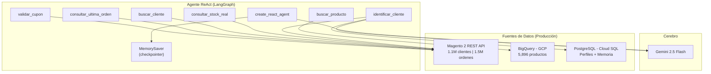
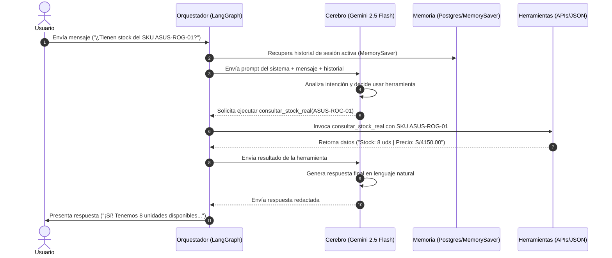

# Agente de Ventas de Retail E-commerce - con Memoria de Cliente

**Proyecto Integrador M2 | IA Generativa**

Agente inteligente de ventas para **Retail E-commerce** (tienda de electrodomésticos y tecnología) que identifica clientes por DNI, recuerda sus compras pasadas, detecta carritos abandonados y personaliza la atención en tiempo real conectándose dinámicamente a la **API REST de Magento 2**, **Google BigQuery** (catálogo de productos) y **PostgreSQL** para la persistencia del perfil y memoria a largo plazo.

---

## 1. Problema de Negocio

### Qué problema tiene la empresa

En las grandes plataformas de e-commerce (como Magento 2), la atención al cliente en canales digitales suele ser **genérica**: el agente humano no tiene visibilidad inmediata del historial del cliente, sus preferencias de compra ni sus carritos abandonados.

### Proceso manual que se busca mejorar

| Proceso actual | Problema | Impacto |
|----------------|----------|---------|
| Cliente contacta por chat/teléfono | El agente no sabe quién es hasta que busca manualmente en el sistema | Tiempo perdido, experiencia impersonal |
| Cliente pregunta por productos | Las recomendaciones son genéricas, sin considerar historial | Baja tasa de conversión |
| Cliente abandona un carrito | Nadie le hace seguimiento proactivo | Se pierden ventas potenciales (~30% de carritos abandonados) |
| Cliente tiene múltiples cuentas | El sistema solo busca en una cuenta | Historial incompleto, mala experiencia |

### Por qué IA Generativa aporta valor

- **Búsqueda de productos por lenguaje natural**: El cliente dice "quiero una laptop para gaming" en vez de navegar categorías.
- **Generación de perfil inteligente**: El LLM analiza decenas de órdenes y genera un resumen de preferencias que un humano tardaría minutos en construir.
- **Recomendaciones personalizadas**: Basadas en historial real, no en reglas estáticas.
- **Memoria conversacional**: Recuerda lo que se habló en sesiones anteriores.
- **Decisión dinámica de herramientas**: El agente decide autónomamente si necesita buscar un producto, consultar stock o validar un cupón según lo que dice el cliente.

### Resultado esperado

Un asistente que en **segundos** identifica al cliente, conoce sus preferencias, detecta oportunidades de venta (carritos abandonados) y personaliza cada interacción.

---

## 2. Análisis Previo

### Usuario objetivo

Clientes del Retail E-commerce que interactúan por canales digitales (chat, WhatsApp, teléfono) y buscan asistencia para compras, consultas de stock, seguimiento de pedidos o recomendaciones.

### Entradas del sistema

| Entrada | Ejemplo |
|---------|---------|
| DNI del cliente | `48014673` |
| Búsqueda de producto en lenguaje natural | "Quiero ver televisores 4K" |
| Consulta de stock por SKU | "¿Tienen stock del SKU ASUS-ROG-01?" |
| Consulta de pedido | "¿Cómo va mi último pedido?" |
| Código de cupón | "¿Es válido el cupón DESCUENTO10?" |

### Decisiones que el agente toma dinámicamente

1. **Cuándo usar `identificar_cliente`**: Si el usuario da un DNI o número de 8 dígitos.
2. **Cuándo usar `buscar_producto`**: Si menciona un producto, marca o categoría.
3. **Cuándo usar `consultar_stock_real`**: Si pregunta por disponibilidad o precio exacto de un SKU.
4. **Cuándo usar `consultar_ultima_orden`**: Si pregunta por el estado de un pedido.
5. **Cuándo usar `validar_cupon`**: Si menciona un código de descuento.
6. **Cuándo NO usar herramientas**: Para saludos, preguntas generales o conversación natural.

### Tareas automatizadas vs. decisión dinámica

| Tarea | Tipo | Justificación |
|-------|------|---------------|
| Pedir DNI al inicio | Predecible | Siempre ocurre al inicio |
| Elegir qué herramienta usar | Dinámico | Depende de lo que diga el cliente |
| Generar resumen de perfil | Predecible | Siempre se ejecuta al identificar un cliente nuevo |
| Personalizar recomendaciones | Dinámico | Depende del historial y el contexto de la conversación |
| Guardar resumen de conversación | Predecible | Siempre ocurre al cerrar la sesión |

### Riesgos y límites

- **Latencia en primera identificación**: La primera vez que un cliente da su DNI, el sistema consulta Magento + genera resumen con IA (~5-10 segundos). Las siguientes veces es instantáneo (caché en PostgreSQL).
- **Clientes con múltiples cuentas**: Un cliente puede tener 2+ cuentas con el mismo DNI pero diferente email. El sistema las consolida automáticamente para tener un historial unificado.
- **Dependencia de APIs externas**: Si Magento o BigQuery no responden, las herramientas fallan *gracefully* con mensajes de error controlados o recurren al catálogo alternativo.

---

## 3. Arquitectura de Solución (Producción)

### Tipo seleccionado: Arquitectura basada en Agente

```
Usuario --> Agente ReAct (create_react_agent) --> Herramientas --> Memoria --> Respuesta final
```

### Justificación

Se eligió una **arquitectura basada en agente** (no workflow ni híbrida) por las siguientes razones:

1. **Las decisiones son dinámicas**: No se puede predecir qué herramienta necesitará el agente en cada turno. Un cliente puede empezar preguntando por stock, luego dar su DNI, luego pedir recomendaciones. El orden no es fijo.
2. **No aplica workflow**: Un workflow requiere pasos predecibles (clasificar -> procesar -> responder). En este caso, el flujo depende enteramente de lo que diga el cliente.
3. **No aplica híbrida**: No hay una parte "simple" que pueda resolverse con un workflow separado. Todas las interacciones requieren razonamiento sobre contexto.
4. **Principio de mínima complejidad**: Un agente ReAct con `create_react_agent` resuelve el problema completo. Agregar un dispatcher o workflow añadiría complejidad sin valor.

### Diagrama de arquitectura de producción



---

## 4. Principio de Mínima Complejidad

| Componente | Incluido | Justificación |
|------------|----------|---------------|
| **Agente ReAct** | Sí | Necesario: el agente decide qué herramienta usar según el contexto |
| **6 herramientas** | Sí | Cada una resuelve una necesidad real del negocio (identificación, catálogo, stock, pedidos, cupones) |
| **Memoria en sesión** (MemorySaver) | Sí | Necesaria: sin ella, el agente pide el DNI en cada turno |
| **Memoria entre sesiones** (PostgreSQL) | Sí | Necesaria: permite recordar conversaciones pasadas y personalizar la próxima visita |
| **Dispatcher** | No | No necesario: un solo agente maneja todas las interacciones |
| **Workflow** | No | No necesario: el flujo no es predecible ni secuencial |
| **Múltiples agentes** | No | No necesario: un solo agente con herramientas es suficiente |
| **RAG / Vectores** | No | No necesario: los datos vienen de APIs estructuradas, no de documentos |
| **Guardrails avanzados** | No | No necesario en esta etapa; el system prompt define los límites |

---

## 5. Orquestación y Componentes

### 5.0 Orquestador

El sistema utiliza un orquestador basado en **LangGraph** (`create_react_agent`), el cual es responsable de coordinar el flujo conversacional del agente conversacional de manera asíncrona e inteligente.

El orquestador recibe el mensaje del usuario, mantiene el estado conversacional y los hilos activos usando un checkpointer (`MemorySaver`), decide cuándo invocar herramientas en base al razonamiento semántico del modelo, procesa los outputs estructurados devueltos por dichas herramientas y finalmente concatena las respuestas para presentarlas al cliente de forma fluida.

En este proyecto, el orquestador y el agente se implementan conjuntamente a través de la interfaz reactiva de `create_react_agent`, evitando separar responsabilidades innecesarias en capas redundantes de software, respetando así el principio de mínima complejidad.

### 5.1 Agente

El agente actúa como el "cerebro" o núcleo de razonamiento (utilizando **Gemini 2.5 Flash**). Recibe directrices estrictas a través de un prompt del sistema sobre cómo comportarse, cuándo solicitar el DNI, cómo recuperar carritos abandonados de forma no invasiva, y cómo personalizar las recomendaciones en base al perfil recuperado desde PostgreSQL.

### 5.2 Dispatcher (No aplica)

No se implementó un dispatcher porque el patrón **ReAct (Reasoning and Acting)** implementado ya realiza una **clasificación implícita de la intención** del usuario en tiempo de ejecución. 

El agente determina dinámicamente qué herramienta utilizar basándose en la semántica y el contexto de la conversación, eliminando la necesidad de un modelo de clasificación previo. Añadir un dispatcher independiente introduciría latencia y complejidad innecesarias sin aportar valor real al flujo conversacional del Retail E-commerce.

### 5.3 Workflow (No aplica)

No se implementó un workflow secuencial debido a que el flujo conversacional no sigue pasos lineales ni predecibles.

En un workflow secuencial tradicional existirían etapas rígidas como:
```
clasificar intención ➔ procesar consulta ➔ responder al cliente
```
Sin embargo, en la atención al cliente real de e-commerce, el usuario puede cambiar de tema en cualquier momento (ej. pasar de consultar un pedido a preguntar por stock de otro artículo o validar un cupón). Un agente dinámico basado en herramientas es la aproximación óptima por su flexibilidad para pivotar según las intenciones del usuario.

### 5.4 Flujo de Funcionamiento Conversacional

El ciclo de vida del procesamiento de un mensaje sigue el siguiente flujo secuencial:



---

## 6. Controles Implementados y Buenas Prácticas

### 6.1 Control de Dominio

El agente conversacional está restringido mediante directrices de su **system prompt** exclusivamente a temas relacionados con el retail e-commerce:
*   Búsqueda de productos del catálogo.
*   Seguimiento y estado de pedidos.
*   Consultas de stock y precios de SKUs.
*   Validación de cupones de descuento.
*   Recomendaciones personalizadas de compra.

Si el usuario realiza consultas sobre temas totalmente ajenos al negocio (como política, medicina o programación), el agente está instruido para desviar educadamente la conversación y redirigir al usuario hacia el dominio permitido del Retail E-commerce.

### 6.2 Confirmación de Acciones Sensibles

Como buena práctica conversacional de diseño de interfaces conversacionales, el agente está diseñado para **solicitar confirmación explícita** antes de realizar o sugerir acciones que impliquen una intención de compra o el inicio de una simulación de pedido.

*Ejemplo de flujo conversacional:*
> **Agente:** "Veo que tienes un carrito de compras pendiente con una Laptop Gaming ASUS ROG. ¿Te gustaría que completemos esa compra o prefieres revisar accesorios compatibles antes?"

Aunque el sistema no procesa pasarelas de pago directas por cuestiones de seguridad, la implementación de patrones de confirmación garantiza que el usuario mantenga el control total y evita falsos positivos en las sugerencias de venta.

### 6.3 Manejo de Errores e Inyecciones

*   **Validación de entrada**: Variables de entorno validadas al inicio; si falta alguna, el sistema falla con mensaje claro.
*   **Manejo de errores en herramientas**: `call_magento_api` captura excepciones y retorna `{"error": ...}` en vez de crashear.
*   **SQL Injection**: La consulta de BigQuery utiliza parámetros (`@busqueda`) en vez de interpolación de strings.
*   **Consolidación de cuentas**: `fetch_customer_by_dni` unifica todas las cuentas del mismo DNI en un único perfil en PostgreSQL.

---

## 7. Demo de Decisiones del Agente (Reasoning Table)

La siguiente tabla ilustra cómo el orquestador ReAct toma decisiones lógicas de forma autónoma en función de las entradas del usuario:

| Mensaje del Usuario | Razonamiento del Agente | Herramienta Ejecutada | Resultado Esperado |
|---------------------|-------------------------|------------------------|--------------------|
| "Hola, mi DNI es 48014673" | Detecta DNI. El agente debe identificar al usuario para personalizar la sesión. | `identificar_cliente(dni="48014673")` | Recupera perfil consolidado e historial de PostgreSQL/Magento. |
| "Quiero una laptop gamer" | El usuario busca un artículo. Debe consultar el catálogo disponible. | `buscar_producto(busqueda="laptop gamer")` | Devuelve lista de SKUs que coinciden con la búsqueda. |
| "¿Tienen stock del SKU ASUS-ROG-01?" | Solicita stock y disponibilidad de un artículo específico en vivo. | `consultar_stock_real(sku="ASUS-ROG-01")` | Retorna cantidad física en almacén y precio actual. |
| "¿Cómo va mi pedido?" | Pregunta por el estado de su orden. Requiere validar sus compras recientes. | `consultar_ultima_orden(identificador="manuel.huaman@gmail.com")` | Muestra el estado del último pedido (`complete`, `pending`, etc.). |
| "Tengo el cupón DESCUENTO10" | Menciona una promoción. Debe validar si la regla de descuento está activa. | `validar_cupon(codigo="DESCUENTO10")` | Confirma validez del cupón para aplicar el descuento. |

---

## 8. Modo de Prueba Local (Mock Data)

Para facilitar el desarrollo, pruebas y demostraciones locales sin requerir conectividad de red activa a Magento ni credenciales de Google BigQuery, el proyecto incluye un **motor simulado integrado** que intercepta las llamadas de red e interactúa directamente con archivos JSON estructurados:

*   [mock_customers.json](file:///c:/Users/patrickpisana/OneDrive%20-%20IMPORTACIONES%20HIRAOKA/Desktop/chat_agente%20-%20v01/mock_customers.json): Simula la respuesta del endpoint `/customers/search`.
*   [mock_orders.json](file:///c:/Users/patrickpisana/OneDrive%20-%20IMPORTACIONES%20HIRAOKA/Desktop/chat_agente%20-%20v01/mock_orders.json): Simula el historial del endpoint `/orders`.
*   [mock_carts.json](file:///c:/Users/patrickpisana/OneDrive%20-%20IMPORTACIONES%20HIRAOKA/Desktop/chat_agente%20-%20v01/mock_carts.json): Simula carritos de compras activos del endpoint `/carts/search`.
*   [mock_products.json](file:///c:/Users/patrickpisana/OneDrive%20-%20IMPORTACIONES%20HIRAOKA/Desktop/chat_agente%20-%20v01/mock_products.json): Simula consultas de stock del catálogo físico en vivo.
*   [mock_coupons.json](file:///c:/Users/patrickpisana/OneDrive%20-%20IMPORTACIONES%20HIRAOKA/Desktop/chat_agente%20-%20v01/mock_coupons.json): Simula la base de cupones de descuento.

---

## 9. Estructura del Proyecto

| Archivo | Propósito |
|---------|-----------|
| `magento_agent.py` | Código principal del agente (herramientas, memoria, configuración e interceptor local) |
| `mock_customers.json` | Datos ficticios de clientes para emulación local de Magento |
| `mock_orders.json` | Historial de transacciones de prueba |
| `mock_carts.json` | Carritos abandonados simulados |
| `mock_products.json` | Catálogo de productos local para pruebas de stock |
| `mock_coupons.json` | Cupones de descuento de prueba |
| `.env` | Variables de entorno (API keys, credenciales) |
| `README.md` | Documentación de arquitectura de producción y local del proyecto |

---

## 10. Stack Tecnológico

*   **Gemini 2.5 Flash** (Google): Cerebro del agente, generación de perfiles y resúmenes.
*   **LangGraph** + **LangChain**: Patrón ReAct con `create_react_agent`.
*   **MemorySaver** (LangGraph): Checkpointer para contexto conversacional.
*   **Magento 2 REST API**: Conexión de producción a la plataforma e-commerce.
*   **BigQuery** (GCP): Catálogo de productos de alta disponibilidad.
*   **PostgreSQL**: Base de datos de persistencia e historiales conversacionales de clientes.

---

## 11. Configuración y Ejecución

### Variables de Entorno (`.env`)

| Variable | Servicio | Para qué |
|----------|----------|----------|
| `GOOGLE_API_KEY` | Google Gemini | Clave API para el modelo LLM |
| `POSTGRES_URI` | PostgreSQL | Conexión a la BD de perfiles de cliente |
| `MAGENTO_BASE_URL` | Magento 2 REST API | URL base de la tienda de producción (en pruebas locales puede ser cualquiera) |
| `MAGENTO_ACCESS_TOKEN` | Magento 2 REST API | Token Bearer (en pruebas locales puede ser cualquiera) |

### Dependencias

```bash
pip install langchain langchain-google-genai langgraph google-cloud-bigquery python-dotenv requests "psycopg[binary,pool]"
```

### Ejecución

```bash
python magento_agent.py
```

### Ejemplo de interacción conversacional

```
=== Agente de Ventas de Retail E-commerce (con memoria de cliente) ===
Escribe 'salir' para terminar.

Tu: Hola
Asistente: ¡Hola! Soy tu asistente de ventas de nuestro Retail E-commerce.
           Para atenderte mejor, ¿podrías darme tu DNI?

Tu: Mi DNI es 48014673
Asistente: ¡Hola Manuel! Veo que eres un cliente frecuente de nuestra tienda.
           Anteriormente has comprado parlantes y una impresora multifuncional Epson EcoTank.
           ¿En qué puedo ayudarte hoy?

Tu: ¿Tienen stock de la laptop ASUS-ROG-01?
Asistente: Sí, la Laptop Gaming ASUS ROG Strix G16 (SKU: ASUS-ROG-01) está disponible. 
           Tenemos 8 unidades en stock con un precio de S/4150.00. ¿Te gustaría adquirirla?

Tu: salir
Guardando resumen de conversación...
Resumen guardado.
¡Hasta luego!
```
